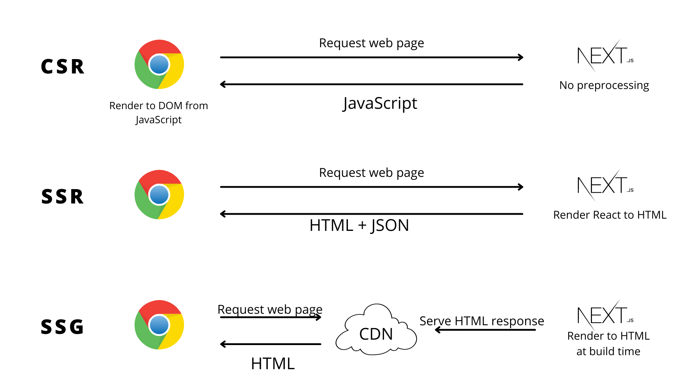
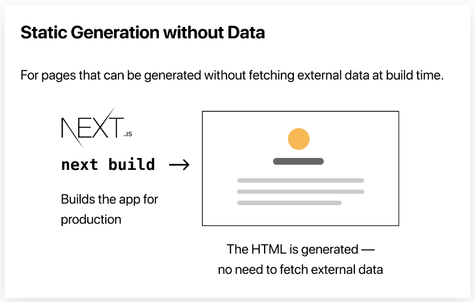
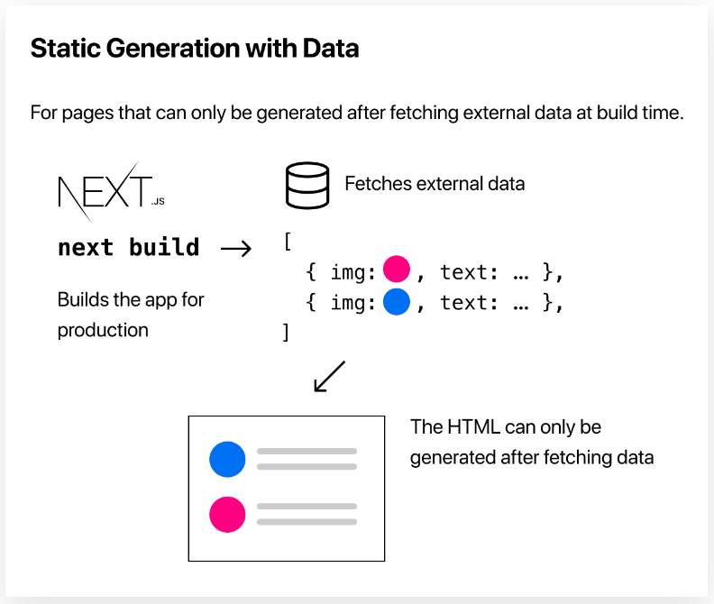
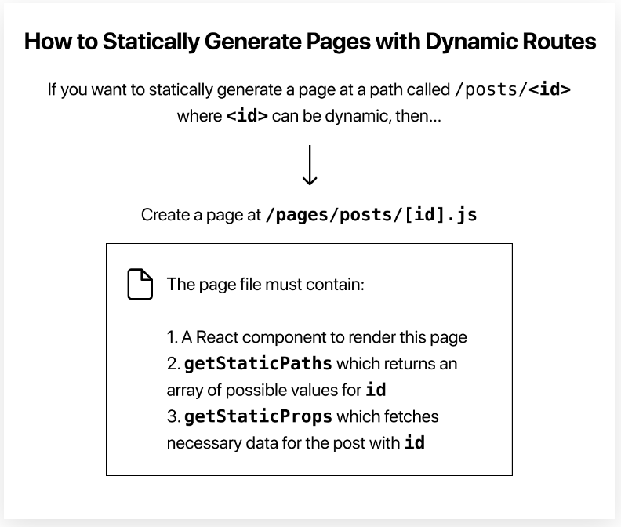

# NEXT JS

## Tính Năng Chính Của NEXTJS

- 1. Routing: Định nghĩa routing dự trên file-system
- 2. Rendering: Hỗ trợ Client-side và cả Server-side rendering. Tối ưu hóa Static and Dynamic Rendering trên server NextJS
- 3. Data Fetching: Fetching data với async/await trên server component và `fetch` có thể mở rộng bằng việc caching, lưu vào bộ nhớ đệm và revalidation
- 4. Styling: Hổ trợ CSS Modules, Tailwind CSS và CSS-in-JS
- 5. Optimizations: Tối ưu hóa hình ảnh, phông chữ và tập lệnh để cải thiện Trải nghiệm người dùng và Các chỉ số quan trọng về trang web cốt lõi của ứng dụng của bạn.
- 6. TypeScript: Hỗ trợ Typescript để dể dàng check kiểu dữ liệu
- 7. Không cần phải config Babel, Webpack phức tạp như React App nữa, mà Next đã làm thay


## App Router vs Pages Router
Next.js có hai bộ định tuyến khác nhau: the App Router và the Pages Router.
    - App Router: là bộ định tuyến mới hơn cho phép bạn sử dụng các tính năng mới nhất của React, chẳng hạn như Thành phần máy chủ và Truyền phát
    - Page Router: là bộ định tuyến Next.js ban đầu, cho phép bạn xây dựng các ứng dụng React do máy chủ kết xuất và tiếp tục được hỗ trợ cho các ứng dụng Next.js cũ hơn.

## Cách Bên Dưới Next Hoạt Động

- 1. Development đến Production: Tùy vào môi trường mà Next sẽ ưu tiên trải nghiệm cho đối tượng khác nhau. Ví dụ ở môi trường Development next sẽ hổ trợ trải nghiệm của Dev như TypeScript, ESLint và Fast Fresh Refresh để dev nhanh hơn. Ở môi trường Production Next sẽ optimize bằng các khái niệm như: compiled, bundled, minified, and code split.
- 2. Compiled: Biên dịch đề cập đến quá trình lấy mã bằng một ngôn ngữ và xuất nó sang ngôn ngữ khác hoặc phiên bản khác của ngôn ngữ đó.
- 3. Minifying: là quá trình loại bỏ các comment code, dấu cách, xuống dòng và định dạng mã không cần thiết mà không thay đổi chức năng của mã. Mục tiêu là cải thiện hiệu suất của ứng dụng bằng cách giảm kích thước tệp. Trong Next.js, các tệp JavaScript và CSS được tự động thu nhỏ để sản xuất.
- 4. Bundling: Đóng gói là quá trình giải quyết web dependencies và merge (hoặc 'package') các tệp (hoặc module) thành các gói được tối ưu hóa cho trình duyệt, với mục tiêu giảm số lượng yêu cầu tệp khi người dùng truy cập trang web.
- 5. Code Splitting: Next.js có hỗ trợ tích hợp để tách mã. Mỗi tệp bên trong `pages/`` của bạn sẽ được tự động chia mã thành gói JavaScript riêng trong bước xây dựng.
- 6. Build Time & Runtime: Build time là thời gian để dev app, bao gồm chuẩn các tệp html static, js chạy trên máy chủ, js chạy trên máy khách, css. Runtime là thời gian ứng dụng chạy để đáp ứng yêu cầu của người dùng
- 7. Client and Server: Client là máy khách gửi yếu cầu đến máy chủ và nhận về phản hồi để render. Máy chủ đề cập đến máy tính trong một trung tâm dữ liệu lưu trữ mã ứng dụng của bạn, nhận yêu cầu từ máy khách, thực hiện một số tính toán và gửi lại phản hồi thích hợp.
- 8. Rendering: Với Next.js, hổ trợ 3 phương thức render là: Server-Side Rendering, Static Site Generation và Client-Side Rendering. Pre-Rendering bao gồm 2 phương thức Server-Side Rendering (`getServerSideProps`), Static Site Generation (`getStaticProps`)
    - . Server-Side Rendering (SSR):
        Server-Side Rendering là quá trình tạo ra trang web từ phía máy chủ trước khi nó được gửi đến trình duyệt. Khi một yêu cầu được gửi từ trình duyệt, máy chủ sẽ xử lý yêu cầu và tạo ra HTML hoàn chỉnh cho trang web. Sau đó, nội dung HTML này được gửi đến trình duyệt và hiển thị cho người dùng.

        Với SSR trong Next.js, trang web được tạo ra từ phía máy chủ mỗi khi có yêu cầu mới. Điều này giúp tối ưu hóa SEO, hiển thị nhanh chóng nội dung cho người dùng và cung cấp trải nghiệm tốt hơn cho ứng dụng web.

    - . Static Site Generation (SSG):
        Static Site Generation là quá trình tạo ra các trang web tĩnh trước khi chúng được gửi đến trình duyệt. Trong Next.js, bạn có thể xác định trước các trang cần được tạo ra và dữ liệu cần được lấy trước. Khi ứng dụng được xây dựng, các trang web tĩnh sẽ được tạo ra và được lưu trữ trên máy chủ hoặc dịch vụ lưu trữ tĩnh. Khi một yêu cầu được gửi từ trình duyệt, trang web tĩnh được gửi trực tiếp từ máy chủ hoặc dịch vụ lưu trữ tĩnh mà không cần xử lý từ phía máy chủ.

        SSG trong Next.js giúp cải thiện hiệu suất và tốc độ tải trang bằng cách giảm thời gian xử lý yêu cầu từ phía máy chủ. Nó cũng cho phép bạn tạo ra các trang web tĩnh với dữ liệu được tạo ra tại thời điểm xây dựng ứng dụng.

- 9. CDN (Content Delivery Network) and the Edge: Trong Next.js, vì pre-rendering có thể được thực hiện trước thời hạn, CDN rất phù hợp để lưu trữ kết quả tĩnh của công việc - giúp phân phối nội dung nhanh hơn. Edge là một máy chủ phẩn bố theo địa lý dùng để chia nhỏ một số đoạn code cho server và client để giảm tải việc chạy trên một Server Gốc.
    - https://nextjs.org/docs/pages/building-your-application/routing/middleware
    - https://nextjs.org/docs/app/building-your-application/rendering/server-components#react-server-components-alpha
    - https://vercel.com/features/edge-functions


## Pre-Rendering và Non Pre-Rendering


### Two Forms of Pre-rendering
Next.js có 2 loại pre-rendering: Static Generation and Server-side Rendering.

- Static Generation là phương thức kết xuất trước tạo HTML tại thời điểm xây dựng. HTML được hiển thị trước sau đó được sử dụng lại trên mỗi yêu cầu.
- Server-side Rendering là phương thức kết xuất trước tạo HTML trên mỗi yêu cầu.


Quan trọng, Next.js cho phép bạn chọn pre-rendering form nào sẽ sử dụng cho mỗi trang. Bạn có thể tạo ứng dụng Next.js "hybrid" bằng cách sử dụng Static Generation cho hầu hết các trang và sử dụng Server-side Rendering cho các trang khác.


### Khi nào nên sử dụng Static Generation so với Server-side Rendering

Chúng tôi khuyên bạn nên sử dụng Static Generation (có và không có dữ liệu) bất cứ khi nào có thể vì trang của bạn có thể được xây dựng một lần và được CDN phục vụ, điều này làm cho nó nhanh hơn nhiều so với việc máy chủ hiển thị trang theo mọi yêu cầu.

Bạn có thể sử dụng Static Generation cho nhiều loại trang, bao gồm:
- Marketing pages
- Blog posts
- E-commerce product listings
- Help and documentation

Bạn nên tự hỏi: "Tôi có thể hiển thị trước trang này trước yêu cầu của người dùng không?" Nếu câu trả lời là có, thì bạn nên chọn Static Generation.

Mặt khác, Tạo tĩnh không phải là một ý tưởng hay nếu bạn không thể hiển thị trước một trang trước yêu cầu của người dùng. Có thể trang của bạn hiển thị dữ liệu được cập nhật thường xuyên và nội dung trang thay đổi theo mọi yêu cầu.

Trong trường hợp đó, bạn có thể sử dụng Server-side Rendering. Nó sẽ chậm hơn, nhưng trang được hiển thị trước sẽ luôn được cập nhật. Hoặc bạn có thể bỏ qua kết xuất trước và sử dụng JavaScript phía máy khách để điền dữ liệu được cập nhật thường xuyên.



### Static Generation with and without Data

- Tạo static generation không có fetching data từ db



- tạo static generation với lấy data từ server




Kết xuất trước và tìm nạp dữ liệu
Tạo tĩnh có và không có dữ liệu
Tạo tĩnh có thể được thực hiện có và không có dữ liệu.

Cho đến nay, tất cả các trang chúng tôi đã tạo không yêu cầu tìm nạp dữ liệu ngoài. Các trang đó sẽ tự động được tạo tĩnh khi ứng dụng được xây dựng để sản xuất.


Tuy nhiên, đối với một số trang, bạn có thể không hiển thị được HTML mà không tìm nạp một số dữ liệu ngoài trước. Có thể bạn cần truy cập hệ thống tệp, tìm nạp API bên ngoài hoặc truy vấn cơ sở dữ liệu của bạn tại thời điểm xây dựng. Tiếp theo.js hỗ trợ trường hợp này - Tạo tĩnh với dữ liệu - ra khỏi hộp.


Tạo tĩnh với Dữ liệu bằng `getStaticProps``

```
export default function Home(props) { ... }

export async function getStaticProps() {
  // Get external data from the file system, API, DB, etc.
  const data = ...

  // The value of the `props` key will be
  //  passed to the `Home` component
  return {
    props: ...
  }
}
```

Về cơ bản, `getStaticProps` cho phép bạn nói với Next.js: "Này, trang này có một số phụ thuộc dữ liệu - vì vậy khi bạn hiển thị trước trang này tại thời build time in production, hãy đảm bảo giải quyết chúng trước!"
    Lưu ý: Trong chế độ phát triển, getStaticProps chạy trên mỗi yêu cầu thay thế.

Development vs. Production
- Trong mội trường dev (npm run dev dev hoặc yarn dev), getStaticProps chạy trên mọi yêu cầu.
- Trong môi trường production, getStaticProps chạy tại build time. However, this behavior can be enhanced using the `fallback` key returned by getStaticPaths

### Server Side Rendering

If you need to fetch data at request time instead of at build time, you can try Server-side Rendering.


To use `Server-side Rendering`, you need to export `getServerSideProps` instead of `getStaticProps` from your page.

```
export async function getServerSideProps(context) {
  return {
    props: {
      // props for your component
    },
  };
}
```

Bạn chỉ nên sử dụng `getServerSideProps` nếu bạn cần render trước một trang có dữ liệu phải được tìm nạp tại thời điểm request. Thời gian đến byte đầu tiên (TTFB) sẽ chậm hơn `getStaticProps` vì máy chủ phải tính toán kết quả trên mọi yêu cầu và kết quả không thể được lưu trữ bởi CDN mà không có cấu hình bổ sung.

### Client-side Rendering

Nếu bạn không cần kết xuất trước dữ liệu, bạn cũng có thể sử dụng chiến lược sau (được gọi là csr):


### SWR

- https://swr.vercel.app/

Nhóm nghiên cứu đằng sau Next.js đã tạo ra một hook React để tìm nạp dữ liệu được gọi là `SWR`. Chúng tôi thực sự khuyên bạn nên sử dụng nó nếu bạn đang tìm nạp dữ liệu ở phía máy khách. Nó xử lý bộ nhớ đệm, xác nhận lại, theo dõi tiêu điểm, lấy lại khoảng thời gian và hơn thế nữa. Chúng tôi sẽ không đề cập đến chi tiết ở đây, nhưng đây là một ví dụ sử dụng:

```
import useSWR from 'swr';

function Profile() {
  const { data, error } = useSWR('/api/user', fetch);

  if (error) return <div>failed to load</div>;
  if (!data) return <div>loading...</div>;
  return <div>hello {data.name}!</div>;
}
```

## Dynamic Routes

Trong bài học này, bạn sẽ học:

- 1. Cách tạo tĩnh các trang có tuyến động bằng `getStaticPaths`.
- 2. Cách viết `getStaticProps` để lấy dữ liệu cho mỗi bài đăng trên blog.
- 3. Cách hiển thị đánh dấu bằng `remark`.
- 4. Làm thế nào để in chuỗi ngày tháng đẹp.
- 5. Cách liên kết đến một trang có `dynamic routes`.
- 6. Một số thông tin hữu ích về các `dynamic routes`.

### Page Path Depends on External Data


dynamic routes là kiểu [id].js trong thư mục page. `id` được gôi là remark



Tóm tắt cách hoạt động của Dynamic Route phía hình trên.

### Fallback
Hãy nhớ lại rằng chúng tôi đã trả về fallback: false từ getStaticPaths. Điều này có nghĩa là gì?

Nếu fallback là false, thì bất kỳ đường dẫn nào không được trả về bởi getStaticPaths sẽ dẫn đến trang 404.

Nếu fallback là true, thì hành vi của getStaticProps sẽ thay đổi:

Các đường dẫn được trả về từ getStaticPaths sẽ được hiển thị thành HTML tại thời điểm xây dựng.
Các đường dẫn chưa được tạo tại thời điểm xây dựng sẽ không dẫn đến trang 404. Thay vào đó, Next.js sẽ phục vụ một phiên bản "dự phòng" của trang trên yêu cầu đầu tiên đến một đường dẫn như vậy.
Trong nền, Tiếp theo.js sẽ tạo tĩnh đường dẫn được yêu cầu. Các yêu cầu tiếp theo đến cùng một đường dẫn sẽ phục vụ trang được tạo, giống như các trang khác được hiển thị trước tại thời điểm xây dựng.
Nếu fallback đang blocking, thì các đường dẫn mới sẽ được hiển thị phía máy chủ với getStaticProps và được lưu vào bộ nhớ cache cho các yêu cầu trong tương lai để nó chỉ xảy ra một lần trên mỗi đường dẫn.

Điều này nằm ngoài phạm vi bài học của chúng tôi, nhưng bạn có thể tìm hiểu thêm về dự phòng: true và fallback: 'blocking' trong tài liệu fallback fallback: true.

### Catch-all Routes

Các tuyến đường động có thể được mở rộng để bắt tất cả các đường dẫn bằng cách thêm ba dấu chấm (...) bên trong dấu ngoặc. Chẳng hạn:

- pages/posts/[...id].js khớp /posts/a, nhưng cũng có /posts/a/b, //posts/a/b/c, v.v./posts/a/posts/a/b

Nếu bạn làm điều này, trong getStaticPaths, bạn phải trả về một mảng dưới dạng giá trị của khóa id như sau:
```
return [
  {
    params: {
      // Statically Generates /posts/a/b/c
      id: ['a', 'b', 'c'],
    },
  },
  //...
];
```

Và params.id một mảng trong getStaticProps:

```
export async function getStaticProps({ params }) {
  // params.id will be like ['a', 'b', 'c']
}
```

### API Routes

Nếu bạn muốn truy cập router Next.js, bạn có thể làm như vậy bằng cách nhập hook useRouter từ next/router.

Api Route sử dụng trong Next khi ở Ui dùng POST để gửi data, và Router Api nhân data và gửi nó đến API Backend ở máy chù khác. Cách này sẽ an toàn vì giấu dk endpoint máy chủ

### Preview Mode
Tìm hiểu thêm
